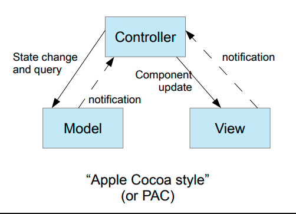

# Photo Gallery Application - MVC/PAC Architecture

A Java Swing photo viewer demonstrating proper JavaSwing **Model-View-Controller (MVC)** architecture (which is more of a PAC!) with clean separation of concerns.

## Architecture

This project emphasizes correct MVC/PAC implementation:



*Apple Cocoa style (PAC): Controller mediates between Model and View with notification-based communication*

### Model (`PhotoComponentModel.java`)
- Manages all application state (photos, annotations, selections)
- Notifies observers via `ChangeListener` pattern
- No UI dependencies

### View (`PhotoComponentView.java`)
- Handles all rendering logic
- Stateless - only draws what it receives
- No business logic

### Controller (`PhotoComponent.java`)
- Handles user input (mouse, keyboard)
- Coordinates between model and view
- Implements `ChangeListener` to respond to model changes

**Communication Flow:**
```
User Input → Controller → Model → ChangeListener → Controller → View → Display
```

## Features

- Import and view photos (JPG, PNG)
- Double-click to flip and annotate photos
- Draw freehand strokes
- Add text annotations
- Multi-select with Shift+Click
- Drag to move annotations
- Color picker for annotations

## Project Structure

```
src/
├── PhotoComponent.java          # Controller
├── PhotoComponentModel.java     # Model
├── PhotoComponentView.java      # View
├── Drawable.java                # Interface for annotations
├── Stroke.java                  # Freehand drawing
├── TextBlock.java               # Text annotation
├── GalleryWindow.java           # Main window
└── Main.java                    # Entry point
```

## Running

```bash
javac -d out src/*.java
java -cp out Main
```

Or run `Main` class in IntelliJ IDEA.

## Usage

- **File → Import**: Load a photo
- **Double-click**: Flip photo to annotation side
- **Click + Drag**: Draw strokes
- **Single-click**: Add text (then type)
- **Shift + Click**: Multi-select annotations

## Key Design Principles

- ✅ Observer pattern for model-controller communication
- ✅ Separation of concerns across MVC layers
- ✅ Stateless view rendering
- ✅ Strategy pattern via `Drawable` interface

## Author
Soheil Lotfi  
Educational project for MVC/PAC architecture study